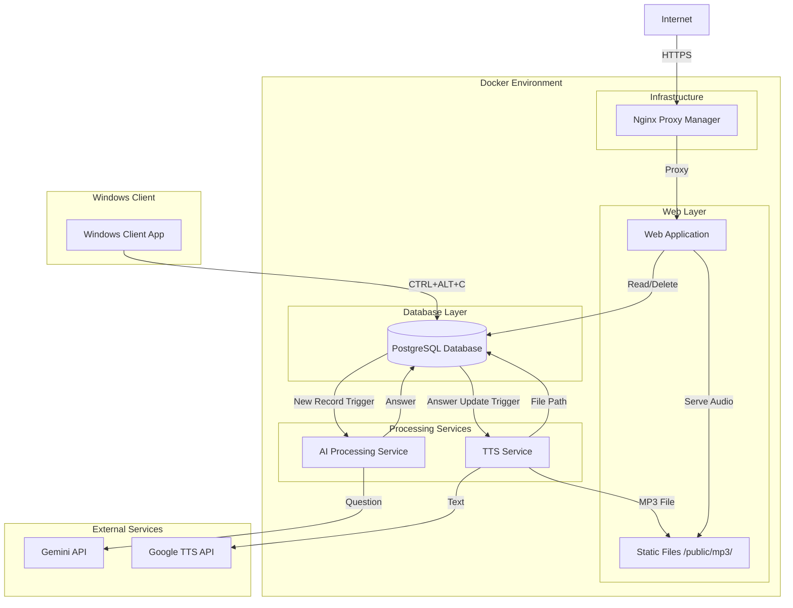

# Design Document

## Overview

The Clipboard-to-TTS system is a distributed application that captures clipboard content via hotkey, processes it through AI to generate intelligent responses, converts those responses to speech, and provides a web interface for playback and management. The system follows a microservices architecture with event-driven processing and is fully containerized for easy deployment.

## Architecture

The system consists of five main components orchestrated through Docker Compose:



### Network Architecture

- **Internal Docker Network**: All containerized services communicate via Docker's internal networking
- **Database Access**: Dual-path connectivity (LAN IP: 10.0.0.44, Fallback: web.korczewski.de)
- **External Access**: Nginx Proxy Manager provides SSL termination and routing
- **File Storage**: Shared volume for MP3 files accessible by both TTS service and web application

## Components and Interfaces

### 1. Windows Client Application

**Technology Stack**: C# .NET Framework or Python with system libraries
**Purpose**: Background service for clipboard capture and database insertion

**Key Components**:
- `HotkeyManager`: Registers and handles CTRL+ALT+C hotkey
- `ClipboardCapture`: Accesses Windows clipboard API
- `DatabaseConnector`: Manages PostgreSQL connections with fallback logic
- `BackgroundService`: Maintains application lifecycle

**Interfaces**:
```csharp
interface IClipboardCapture {
    string GetClipboardText();
}

interface IDatabaseConnector {
    Task<bool> ConnectAsync();
    Task<int> InsertQuestionAsync(string question);
}

interface IHotkeyManager {
    void RegisterHotkey(Keys keys, Action callback);
    void UnregisterHotkeys();
}
```

**Connection Strategy**:
1. Primary: Direct connection to 10.0.0.44:5432
2. Fallback: Connection via web.korczewski.de (tunneled through Nginx)
3. Retry logic with exponential backoff

### 2. PostgreSQL Database

**Schema Design**:
```sql
CREATE TABLE questions_answers (
    id SERIAL PRIMARY KEY,
    question TEXT NOT NULL,
    answer TEXT,
    mp3path VARCHAR(255),
    created_at TIMESTAMP DEFAULT CURRENT_TIMESTAMP,
    updated_at TIMESTAMP DEFAULT CURRENT_TIMESTAMP
);

-- Triggers for processing pipeline
CREATE OR REPLACE FUNCTION notify_new_question()
RETURNS TRIGGER AS $$
BEGIN
    PERFORM pg_notify('new_question', NEW.id::text);
    RETURN NEW;
END;
$$ LANGUAGE plpgsql;

CREATE TRIGGER question_inserted
    AFTER INSERT ON questions_answers
    FOR EACH ROW
    WHEN (NEW.answer IS NULL)
    EXECUTE FUNCTION notify_new_question();

CREATE OR REPLACE FUNCTION notify_new_answer()
RETURNS TRIGGER AS $$
BEGIN
    IF OLD.answer IS NULL AND NEW.answer IS NOT NULL THEN
        PERFORM pg_notify('new_answer', NEW.id::text);
    END IF;
    RETURN NEW;
END;
$$ LANGUAGE plpgsql;

CREATE TRIGGER answer_updated
    AFTER UPDATE ON questions_answers
    FOR EACH ROW
    EXECUTE FUNCTION notify_new_answer();
```

**Configuration**:
- Connection pooling enabled
- SSL mode configurable via environment
- Persistent storage via Docker volumes
- Backup strategy through volume snapshots

### 3. AI Processing Service

**Technology Stack**: Node.js or Python
**Purpose**: Monitors for new questions and generates AI responses

**Key Components**:
- `DatabaseListener`: Listens for PostgreSQL notifications
- `GeminiClient`: Handles Gemini API interactions
- `QuestionProcessor`: Orchestrates the AI processing workflow
- `RetryManager`: Implements exponential backoff for failed requests

**Processing Flow**:
1. Listen for `new_question` notifications
2. Fetch question from database
3. Send to Gemini API with configured parameters
4. Update database with response
5. Handle errors with retry logic

**Interfaces**:
```javascript
class GeminiClient {
    async generateAnswer(question, apiKey, gemId) {
        // Gemini API integration
    }
}

class QuestionProcessor {
    async processQuestion(questionId) {
        // Main processing logic
    }
}
```

### 4. TTS Service

**Technology Stack**: Node.js or Python with Google TTS
**Purpose**: Converts AI answers to MP3 audio files

**Key Components**:
- `DatabaseListener`: Listens for answer updates
- `TTSClient`: Google Text-to-Speech integration
- `FileManager`: Handles MP3 file creation and storage
- `PathUpdater`: Updates database with file references

**Processing Flow**:
1. Listen for `new_answer` notifications
2. Fetch answer text from database
3. Convert to speech using Google TTS
4. Save MP3 file with ID-based naming
5. Update database with file path

**File Management**:
- Storage location: `/public/mp3/{id}.mp3`
- Naming convention: Record ID + .mp3 extension
- Cleanup on record deletion

### 5. Web Application

**Technology Stack**: Node.js with Express or React/Next.js
**Purpose**: User interface for browsing and playing question-answer pairs

**Frontend Components**:
- `RecordList`: Scrollable list of record IDs
- `AnswerDisplay`: Shows selected answer text
- `AudioPlayer`: Custom player with full controls
- `DeleteButton`: Record management functionality

**Backend API**:
```javascript
// REST API endpoints
GET /api/records          // List all record IDs
GET /api/records/:id      // Get specific record
DELETE /api/records/:id   // Delete record and MP3
GET /mp3/:id.mp3         // Serve audio files
```

**UI Layout**:
```
┌─────────────────────────────────────────┐
│ Clipboard TTS System                    │
├──────────┬──────────────────────────────┤
│ IDs      │ Answer Display               │
│ ┌──────┐ │ ┌──────────────────────────┐ │
│ │  1   │ │ │ Answer text here...      │ │
│ │  2   │ │ │                          │ │
│ │  3   │ │ └──────────────────────────┘ │
│ │ ...  │ │ ┌──────────────────────────┐ │
│ │      │ │ │ [▶] [⏸] [⏹] [🔊] [⚡]    │ │
│ │      │ │ │ ████████░░░░ 60%         │ │
│ └──────┘ │ └──────────────────────────┘ │
│          │ [Delete Record]              │
└──────────┴──────────────────────────────┘
```

## Data Models

### Question-Answer Record
```typescript
interface QuestionAnswerRecord {
    id: number;
    question: string;
    answer?: string;
    mp3path?: string;
    created_at: Date;
    updated_at: Date;
}
```

### Processing States
```typescript
enum ProcessingState {
    QUESTION_CAPTURED = 'question_captured',
    AI_PROCESSING = 'ai_processing',
    AI_COMPLETED = 'ai_completed',
    TTS_PROCESSING = 'tts_processing',
    COMPLETED = 'completed',
    ERROR = 'error'
}
```

## Error Handling

### Database Connection Failures
- **Windows Client**: Automatic fallback from LAN to web domain
- **Services**: Connection pooling with automatic reconnection
- **Retry Strategy**: Exponential backoff with maximum retry limits

### API Failures
- **Gemini API**: Retry with exponential backoff, rate limit handling
- **Google TTS**: Fallback to alternative TTS services if configured
- **Error Logging**: Structured logging with correlation IDs

### File System Errors
- **MP3 Creation**: Temporary file handling with atomic moves
- **Storage Full**: Cleanup of old files based on retention policy
- **Permission Issues**: Proper Docker volume mounting and permissions

### Web Application Errors
- **Database Unavailable**: Graceful degradation with cached data
- **Missing MP3 Files**: Show text-only mode with error indication
- **Network Issues**: Offline-capable UI with sync when reconnected

## Testing Strategy

### Unit Testing
- **Windows Client**: Mock clipboard and database interactions
- **Services**: Mock external API calls and database operations
- **Web App**: Component testing with mocked backend

### Integration Testing
- **Database Triggers**: Test notification system end-to-end
- **API Integration**: Test Gemini and Google TTS with test accounts
- **File Operations**: Test MP3 creation and cleanup workflows

### System Testing
- **Docker Compose**: Full system deployment testing
- **Network Connectivity**: Test both LAN and web domain connections
- **Load Testing**: Simulate multiple concurrent clipboard captures

### Performance Testing
- **Database Performance**: Test with large datasets (10k+ records)
- **TTS Processing**: Measure conversion times for various text lengths
- **Web Interface**: Test responsiveness with many records

### Security Testing
- **API Key Management**: Ensure secure environment variable handling
- **Database Access**: Test connection security and authentication
- **Web Security**: HTTPS enforcement, input validation, XSS prevention

## Deployment Configuration

### Docker Compose Structure
```yaml
version: '3.8'
services:
  postgres:
    image: postgres:15
    environment:
      - POSTGRES_DB=${DB_NAME}
      - POSTGRES_USER=${DB_USER}
      - POSTGRES_PASSWORD=${DB_PASSWORD}
    volumes:
      - postgres_data:/var/lib/postgresql/data
    ports:
      - "5432:5432"

  ai-service:
    build: ./ai-service
    environment:
      - GEMINI_API_KEY=${GEMINI_API_KEY}
      - GEM_ID=${GEM_ID}
    depends_on:
      - postgres

  tts-service:
    build: ./tts-service
    environment:
      - GOOGLE_TTS_KEY=${GOOGLE_TTS_KEY}
    volumes:
      - ./public/mp3:/app/public/mp3
    depends_on:
      - postgres

  web-app:
    build: ./web-app
    ports:
      - "3000:3000"
    volumes:
      - ./public/mp3:/app/public/mp3
    depends_on:
      - postgres

volumes:
  postgres_data:
```

### Environment Variables
```bash
# Database Configuration
DB_NAME=clipboard_tts
DB_USER=postgres
DB_PASSWORD=secure_password
DB_HOST=postgres
DB_PORT=5432

# API Keys
GEMINI_API_KEY=your_gemini_key
GEM_ID=your_gem_id
GOOGLE_TTS_KEY=your_google_tts_key

# Network Configuration
WEB_DOMAIN=web.korczewski.de
LAN_IP=10.0.0.44
```

### Nginx Proxy Manager Configuration
- **Domain**: web.korczewski.de
- **Target**: http://10.0.0.44:3000
- **SSL**: Let's Encrypt automatic certificate
- **WebSocket Support**: Enabled for real-time features
- **Database Proxy**: Optional tunnel for external database access